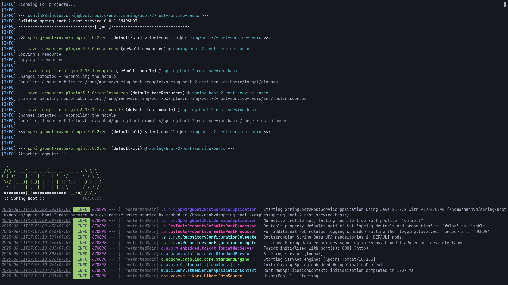
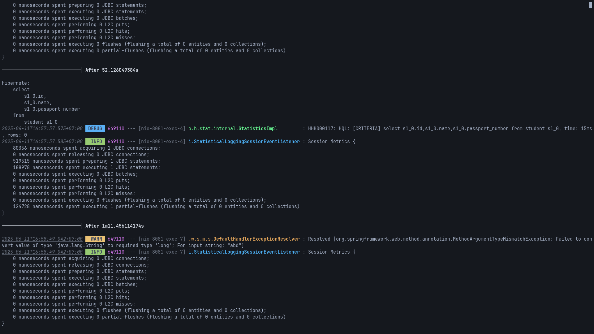

# sbbeautify

`sbbeautify` makes your Spring Boot console logging more beautiful without configuring anything for each project.




<sub>Project used: [in28minutes's Spring Boot Examples](https://github.com/in28minutes/spring-boot-examples/tree/master/spring-boot-2-rest-service-basic)</sub>

## Building

```sh
make
```

## Usage

### Maven

```sh
./mvnw spring-boot:run |& sbbeautify
```

### Gradle

```sh
./gradlew bootRun |& sbbeautify
```

## Inspiration

The name `sbbeautify` is inspired by [`xcbeautify`](https://github.com/cpisciotta/xcbeautify).
